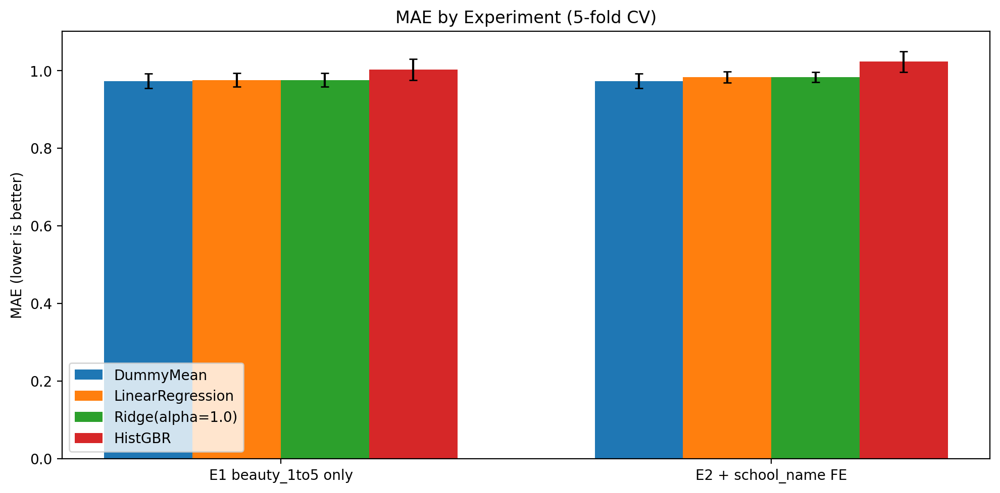
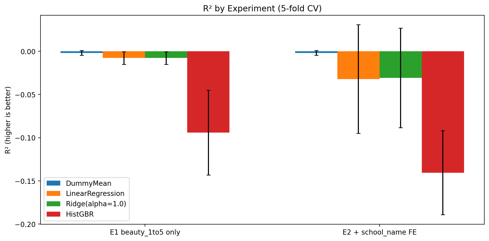

# Good Looking, Good Rating? Beauty Premium in the Course Evaluation

- Authors: Kuang Sheng & Liyan Wang

- Instructor: Markus Neumann

## Research Question

  Do physically attractive professors receive more favorable student evaluations? 
  
  This project builds a machine-learning pipeline that predicts professors’ course evaluation outcomes from facial images. We will construct a biographical dataset of professors from several U.S. universities, combining portrait photos with third-party evaluation measures from RateMyProfessors (RMP). Using an established deep-learning model (Liang et al., 2018) for facial attractiveness prediction, we will generate a standardized “beauty score” for each professor and link it to their RMP ratings. 
  We will then train and compare multiple predictive models, such as linear regression with regularization (Ridge/Lasso), logistic regression (for high- vs. low-rating classification), and gradient-boosted trees (e.g., XGBoost), to assess predictive performance and identify the most suitable approach for this task.

## Division of Responsibilities

### Kuang Sheng
- **Primary responsibilities**
  - Web-scrape faculty profile photos from university/department websites
  - Train predictive models (logistic regression; gradient-boosted trees such as XGBoost)
  - Evaluate model performance (e.g., MAE/RMSE/AUC; cross-validation as needed)
  - Draft the report and visualize key results


### Liyan Wang
- **Primary responsibilities**
  - Web-scrape professor ratings from RateMyProfessors (RMP)
  - Apply the pre-trained deep-learning model to generate professors’ beauty scores
  - Train baseline predictive models (linear regression with/without regularization)
  - Draft the report and visualize key results

## Data
Our latest dataset covers professors from six U.S. engineering schools/colleges, MIT School of Engineering, UCLA Samueli School of Engineering, USC Viterbi School of Engineering, UIUC Grainger College of Engineering, OSU College of Engineering, and WFU Department of Engineering, and primarily includes course-evaluation outcomes and faculty profile photos.

### RateMyProfessors Crawler

This repository includes a [crawler script](RMP_data/rmp_crawler_new.py) that fetches professor ratings from RateMyProfessors and writes them to a CSV file.

### Faculty Photo Scraper

This repository also includes [school-specific web-scraper scripts](photo_scraper/) that fetch professors' photos from university websites.

### Data of RateMyProfessors
Please refer to the latest version of data [here](RMP_data/).


### Data of Faculty Photos

Please refer to the latest version of data through this link: https://drive.google.com/drive/folders/1rZJVfmevApVX-XWipRbNk7OwWT1ggDXz?usp=sharing

## SCUT-FBP5500 Beauty Score Inference (CSV)

This repo includes a script that loads the pretrained SCUT-FBP5500 PyTorch models and appends a `beauty_score` column to a CSV containing image paths.

### 1) Download the pretrained model

From the official SCUT-FBP5500 release: https://github.com/HCIILAB/SCUT-FBP5500-Database-Release

- Download the **PyTorch** trained models archive and extract it locally.
- Choose one of the `.pth` files, such as `alexnet.pth` or `resnet18.pth`.

### 2) Prepare your CSV

Your CSV should include a column with image paths. For example:

```csv
name,image_path
Professor A,/path/to/image_a.jpg
Professor B,/path/to/image_b.jpg
```

### 3) Run inference

```bash
python beauty_score_from_csv.py \
  --input-csv professors.csv \
  --image-column image_path \
  --model-arch alexnet \
  --weights /path/to/alexnet.pth \
  --output-csv professors_with_scores.csv
```

If images are relative paths, they will be resolved relative to the CSV file location. Any failures are logged to an `_errors.txt` file alongside the output CSV.

## Baseline Models and Evaluation Strategy 

Our lowest benchmark is a mean-prediction Dummy Regressor, which predicts the average 
instructor rating observed in the training data. This model provides a reference point for 
assessing whether facial-attractiveness information contributes any predictive value beyond a 
naive baseline. 
We then implement Linear Regression and Ridge Regression as the primary baseline models. 
Linear regression allows us to test whether predicted facial-beauty scores are linearly 
associated with course-evaluation outcomes. Ridge regression is particularly appropriate 
given the small sample size and the inclusion of categorical variables, helping to stabilize 
coefficient estimates and reduce overfitting. 

All baseline models use the same limited feature set: the raw beauty score inferred from 
faculty profile photos, along with two categorical controls indicating department (e.g., 
Computer Science) and school. No additional demographic or professional characteristics are 
included at this stage, ensuring that the baseline remains intentionally simple and 
interpretable. 

Model evaluation focuses primarily on Mean Absolute Error (MAE), which is reported in the 
same scale as instructor ratings and is robust to outliers. Root Mean Squared Error (RMSE) 
and R² are also reported as supplementary metrics to provide a fuller picture of predictive 
performance.
## Baseline Models Performance

- **Week 3 Piloted Sample**
  - **Linear Regression / Ridge:** MAE = 0.83 (RMSE = 0.99), slightly better than the mean baseline (MAE = 0.87; RMSE = 1.03).
  - **Ridge vs. OLS:** Ridge performs marginally better, consistent with regularization stabilizing estimates in a small-sample setting.
  - **R² (cross-validated):** remains negative, suggesting the current inputs, primarily raw beauty score + categorical controls (school, department), explain limited out-of-sample variation in RMP ratings.
  - **HistGBR (tree baseline):** does not outperform the mean baseline, indicating little evidence of robust non-linear patterns given current features and sample size.


- **Week 4 Controlled Experiment**
  - **E1 (beauty only)**  
  avg_rating_i = β0 + β1 · beauty_i + ε_i

  - **E2 (beauty + school fixed effects)**  
  avg_rating_i = β0 + β1 · beauty_i + Σ_{s=1}^{S-1} γ_s · 1[school_i = s] + ε_i
    
  - **What is held constant:** same cleaned sample (drop missing avg_rating; **N = 552**), same 5-fold cross-validation (same split strategy + random seed), same models (**DummyMean, Linear Regression, Ridge, HistGBR**), and same metrics (**MAE, RMSE, R²**).
  - **What changes:** only the **feature set** (E1 uses beauty score only; E2 adds **school indicators**). This isolates whether adding school information improves predictive performance.

- **Results and interpretation**
  - Across both experiments, performance is only marginally better than a mean-prediction baseline: **MAE ≈ 0.97–0.98** and **RMSE ≈ 1.16–1.23**.
  - Cross-validated **R² is close to zero or negative**, indicating the models often do no better than predicting the average rating.
  - Adding **school fixed effects** does **not** improve predictive accuracy and can slightly worsen out-of-sample generalization in some specifications.




