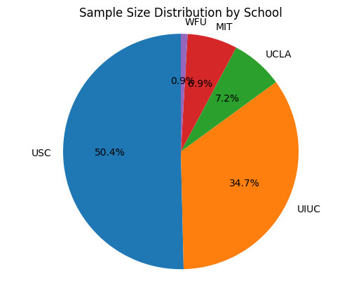
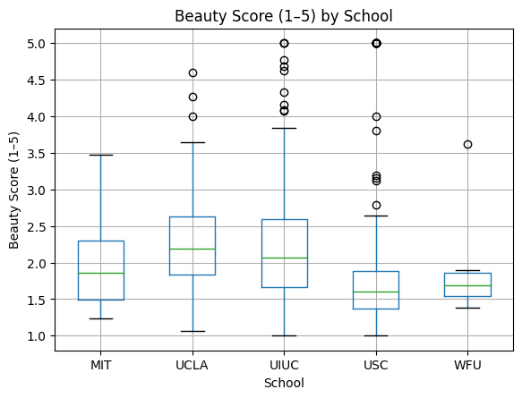
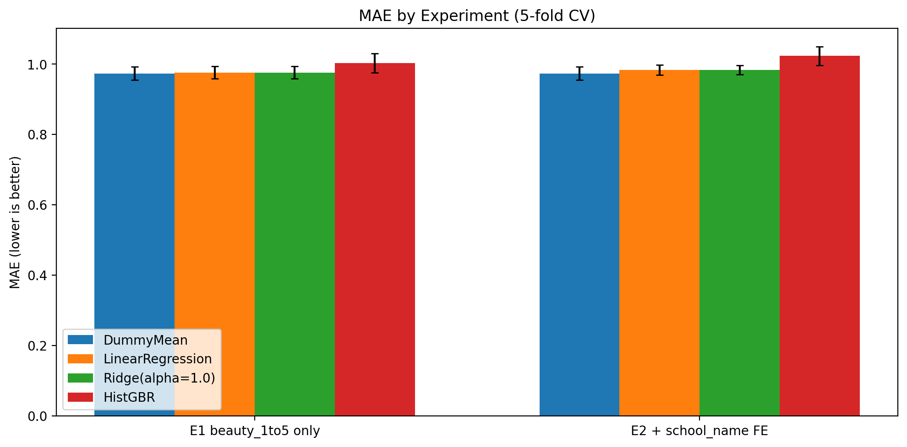
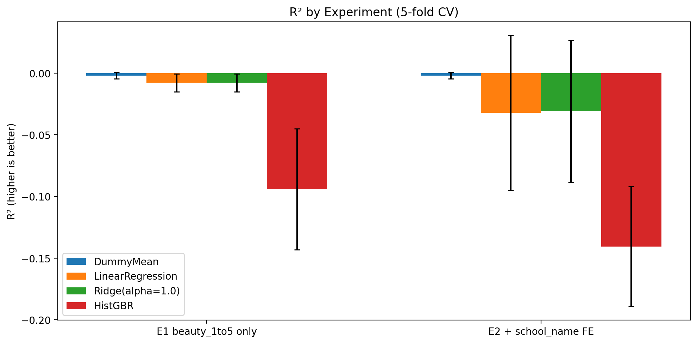
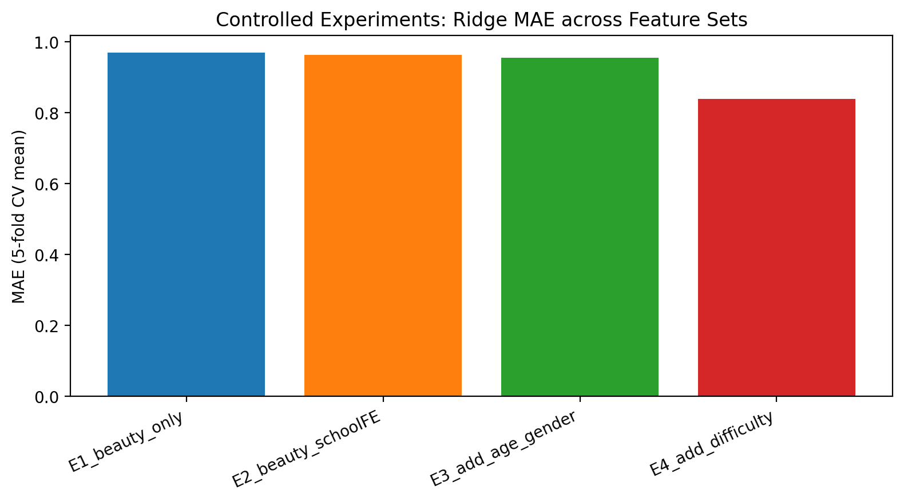
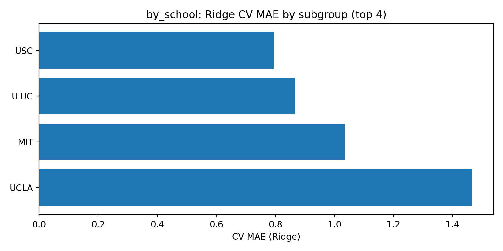
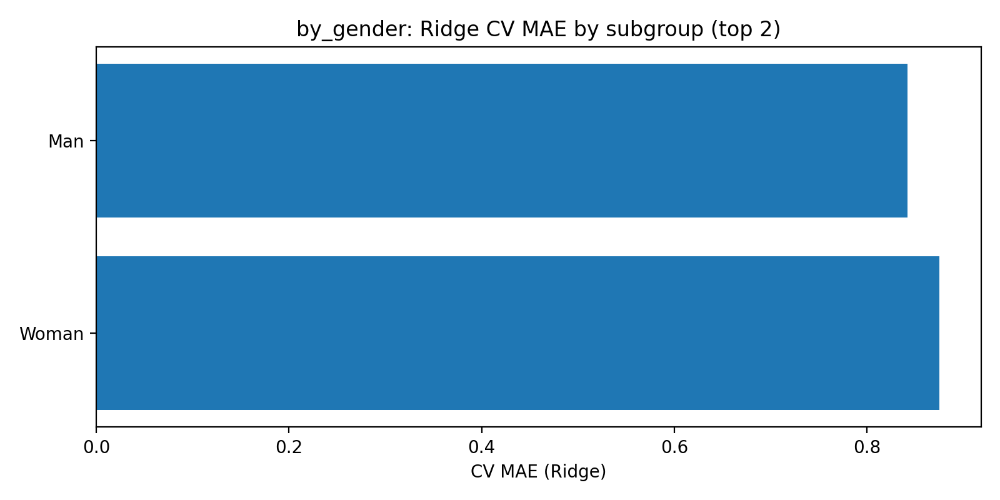
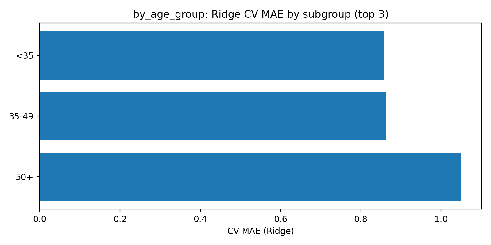
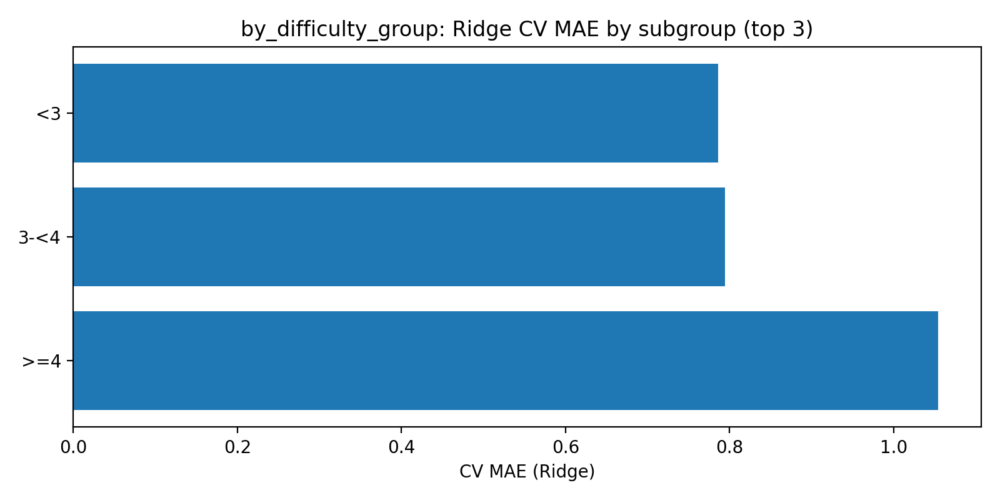

# Good Looking, Good Rating? Beauty Premium in the Course Evaluation

- Authors: Kuang Sheng & Liyan Wang

- Instructor: Markus Neumann

## Research Question

  Do physcially (facially) attractive professors receive more favorable student evaluations? 
  
  This project builds a machine-learning pipeline to predict professors’ course evaluation outcomes from facial images. We construct a biographical dataset of faculty from several U.S. universities by pairing publicly available portrait photos with third-party evaluation measures from RateMyProfessors (RMP). Using an established deep-learning model for facial attractiveness prediction (Liang et al., 2018), we generate a standardized beauty score for each professor and link it to their RMP ratings. We then train and compare multiple predictive models—including OLS, Ridge regression, and histogram-based gradient-boosted trees (HistGBR), to assess predictive performance and determine which approach is most suitable for this task.

## Division of Responsibilities

### Kuang Sheng
- **Primary responsibilities**
  - Web-scrape faculty profile photos from university/department websites
  - Train predictive models (logistic regression; gradient-boosted trees such as XGBoost)
  - Evaluate model performance (e.g., MAE/RMSE/AUC; cross-validation as needed)
  - Draft the report and visualize key results


### Liyan Wang
- **Primary responsibilities**
  - Web-scrape professor ratings from RateMyProfessors (RMP)
  - Apply the pre-trained deep-learning model to generate professors’ beauty scores
  - Train baseline predictive models (linear regression with/without regularization)
  - Draft the report and visualize key results

## Data
Our latest dataset covers professors from six U.S. engineering schools/colleges, MIT School of Engineering, UCLA Samueli School of Engineering, USC Viterbi School of Engineering, UIUC Grainger College of Engineering, OSU College of Engineering, and WFU Department of Engineering, and primarily includes course-evaluation outcomes and faculty profile photos.



### RateMyProfessors Crawler

This repository includes a [crawler script](Data/RMP-Data/rmp_crawler_new.py) that fetches professor ratings from RateMyProfessors and writes them to a CSV file.

### Faculty Photo Scraper

This repository also includes [school-specific web-scraper scripts](Data/photo_scraper) that fetch professors' photos from university websites.

### Data of RateMyProfessors
Please refer to the latest version of data [here](Data/RMP-Data/rmp_engineering_departments_dedup.csv).

### Data of Faculty Photos

Please refer to the latest version of data through this link: https://drive.google.com/drive/folders/1rZJVfmevApVX-XWipRbNk7OwWT1ggDXz?usp=sharing.

## SCUT-FBP5500 Beauty Score Inference (CSV)

This repo includes a script that loads the pretrained SCUT-FBP5500 PyTorch models and appends a `beauty_score` column to a CSV containing image paths.

### 1) Download the pretrained model

From the official SCUT-FBP5500 release: https://github.com/HCIILAB/SCUT-FBP5500-Database-Release

- Download the **PyTorch** trained models archive and extract it locally.
- Choose one of the `.pth` files, such as `alexnet.pth` or `resnet18.pth`.

### 2) Prepare your CSV

Your CSV should include a column with image paths. For example:

```csv
name,image_path
Professor A,/path/to/image_a.jpg
Professor B,/path/to/image_b.jpg
```

### 3) Run inference

```bash
python beauty_score_from_csv.py \
  --input-csv professors.csv \
  --image-column image_path \
  --model-arch alexnet \
  --weights /path/to/alexnet.pth \
  --output-csv professors_with_scores.csv
```

If images are relative paths, they will be resolved relative to the CSV file location. Any failures are logged to an `_errors.txt` file alongside the output CSV.


.png)

## Facial Attribute Inference (DeepFace)

We use **DeepFace** (link:https://github.com/serengil/deepface?tab=readme-ov-file) to infer additional covariates from faculty profile photos. Specifically, we apply the `DeepFace.analyze` function to predict **age** and **gender** from each headshot and then merge these outputs back to our tabular dataset by professor name / photo filename.

### What we run
- **Input:** a headshot image file (downloaded from each school’s faculty directory).
- **Output:** predicted attributes (e.g., `age`, `gender`) plus a status flag indicating whether face analysis succeeded.
- **Purpose:** enrich the baseline feature set and cross-check potential issues such as missing or mismatched headshots.

### Example (DeepFace.analyze)
```python
from deepface import DeepFace

img_path = "images/Jane_Doe.jpg"
result = DeepFace.analyze(
    img_path=img_path,
    actions=["age", "gender"],
    enforce_detection=True,  # set False if you prefer "best effort"
)

# DeepFace returns a dict (or a list of dicts depending on version/settings)
print(result)
```
## Baseline Models and Evaluation Strategy 

We benchmark our models against a mean-prediction Dummy Regressor, which always predicts the average instructor rating in the training data. This provides a minimal reference point for assessing whether facial-attractiveness information adds predictive value. We then fit three baseline learners: Linear Regression and Ridge Regression, which test for linear associations (with Ridge adding regularization to stabilize estimates and reduce overfitting in a small sample with categorical controls), and HistGradientBoostingRegressor (HistGBR), a gradient-boosted tree model included to capture potential nonlinearities and interactions beyond linear specifications.

All models use the same feature set: the beauty score（1-5）inferred from profile photos, plus the categorical indicator for school. Performance is evaluated primarily using MAE, with RMSE and R² reported as complementary metrics.

## Baseline Models Performance

- **Week 3 Piloted Sample**
  - **Linear Regression / Ridge:** MAE = 0.83 (RMSE = 0.99), slightly better than the mean baseline (MAE = 0.87; RMSE = 1.03).
  - **Ridge vs. OLS:** Ridge performs marginally better, consistent with regularization stabilizing estimates in a small-sample setting.
  - **R² (cross-validated):** remains negative, suggesting the current inputs, primarily raw beauty score + categorical controls (school, department), explain limited out-of-sample variation in RMP ratings.
  - **HistGBR (tree baseline):** does not outperform the mean baseline, indicating little evidence of robust non-linear patterns given current features and sample size.
  

  | MAE | RMSE | R2 |
  |---|---|---|
  |  |  |  |

  
- **Week 4 Controlled Experiment**
  - **E1 (beauty only)**  
  avg_rating_i = β0 + β1 · beauty_i + ε_i

  - **E2 (beauty + school fixed effects)**  
  avg_rating_i = β0 + β1 · beauty_i + Σ_{s=1}^{S-1} γ_s · 1[school_i = s] + ε_i
    
  - **What is held constant:** same cleaned sample (drop missing avg_rating; **N = 552**), same 5-fold cross-validation (same split strategy + random seed), same models (**DummyMean, Linear Regression, Ridge, HistGBR**), and same metrics (**MAE, RMSE, R²**).
  - **What changes:** only the **feature set** (E1 uses beauty score only; E2 adds **school indicators**). This isolates whether adding school information improves predictive performance.

- **Results and interpretation**
  - Across both experiments, performance is only marginally better than a mean-prediction baseline: **MAE ≈ 0.97–0.98** and **RMSE ≈ 1.16–1.23**.
  - Cross-validated **R² is close to zero or negative**, indicating the models often do no better than predicting the average rating.
  - Adding **school fixed effects** does **not** improve predictive accuracy and can slightly worsen out-of-sample generalization in some specifications.

  | MAE | RMSE | R2 |
  |---|---|---|
  |  |  |  |

- **Week 5 Controlled Experiments (Regression)**
  - **E1 (beauty only):** Use the beauty score as the only predictor of `avg_rating`.
  - **E2 (+ school fixed effects):** Add `school_name` indicators (one-hot encoded) to control for school-level differences.
  - **E3 (+ age and gender):** Further add DeepFace-inferred `age_pred` (continuous) and `gender_pred` (categorical).
  - **E4 (+ course difficulty):** Additionally include `avg_difficulty` as a course-related control.
  - **What is held constant:** same cleaned sample (N = 532), same preprocessing pipeline, same 5-fold CV (same split strategy + random seed), same model set, and same evaluation metrics.
  - **What changes:** only the feature set (E1 → E4). This isolates the incremental contribution of each added feature block.

- **Week 5 Results and Interpretation (Regression)**
  - Beauty alone provides little predictive signal for instructor ratings; performance is close to a mean-prediction baseline.
  - Adding school fixed effects yields limited improvement, suggesting that between-school average differences do not explain much within-school variation.
  - Adding age and gender produces a small gain, consistent with these attributes capturing some heterogeneity in evaluation patterns.
  - Adding course difficulty yields the largest improvement, indicating that course-related information is substantially more predictive of ratings than facial-attractiveness measures.
  

- **Week 6 Controlled Experiments Results**
  - We report an updated 5-fold cross-validated performance for each model across controlled specifications. Each cell is **MAE / RMSE / R²**.

| model            | E1_beauty_only         | E2_beauty_schoolFE     | E3_add_age_gender      | E4_add_difficulty      |
|:-----------------|:-----------------------|:-----------------------|:-----------------------|:-----------------------|
| DummyMean        | 0.967 / 1.151 / -0.007 | 0.967 / 1.151 / -0.007 | 0.967 / 1.151 / -0.007 | 0.967 / 1.151 / -0.007 |
| HistGBR          | 1.006 / 1.205 / -0.104 | 0.992 / 1.203 / -0.100 | 1.031 / 1.257 / -0.200 | 0.935 / 1.178 / -0.060 |
| LinearRegression | 0.968 / 1.153 / -0.010 | 0.969 / 1.155 / -0.013 | 0.967 / 1.156 / -0.017 | 0.850 / 1.059 / 0.144  |
| Ridge(alpha=1.0) | 0.968 / 1.153 / -0.010 | 0.969 / 1.154 / -0.012 | 0.966 / 1.156 / -0.016 | 0.850 / 1.059 / 0.145  |

- **Week 6 Subgroup Analysis**
  - **Goal:** Test whether the predictive role of **beauty** varies by context.
  - **Method:** Split the dataset by subgroup and, **within each subgroup**, run the **same Ridge regression (α = 1.0)** with the **same 5-fold CV** procedure as in the main analysis.
  - **Splits:**
    - **School:** analyzed separately by institution.
    - **Gender:** male vs female.
    - **Age group:** <40 (younger), 40–49 (middle-aged), ≥50 (older).
    - **Difficulty:** low (<3), mid (3–4), high (>=4).

  - **Key findings (heterogeneity):**
    - **Across schools:** performance varies substantially—R² ≈ **0.20 (USC)** and **0.11 (UIUC)**, but **near zero or negative** for **MIT** and **UCLA**, indicating inconsistent generalization across institutions.
    - **Across gender:** performance is similar—R² ≈ **0.13 (male)** vs **0.10 (female)**; MAE/RMSE differences are small → limited gender-based heterogeneity.
    - **Across age:** predictive strength declines with age and becomes **negative for ≥50**, with slightly higher MAE/RMSE → weaker fit for older professors.
    - **Across difficulty:** signal is somewhat stronger in **mid difficulty (R² ≈ 0.09)** with modestly lower MAE/RMSE, but **negative** in **low** and **high** difficulty groups → errors remain close to baseline.

  - **Takeaway:** Beauty’s predictive contribution remains **small** overall and appears **context-dependent** rather than stable across subgroups.


  | School | Gender |
  |---|---|
  |  |  |

  | Age | Difficulty |
  |---|---|
  |  |  |
